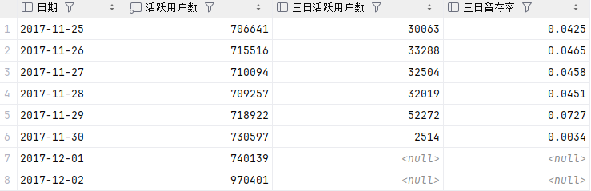
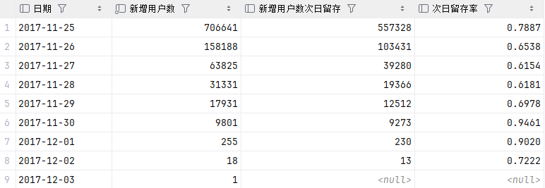
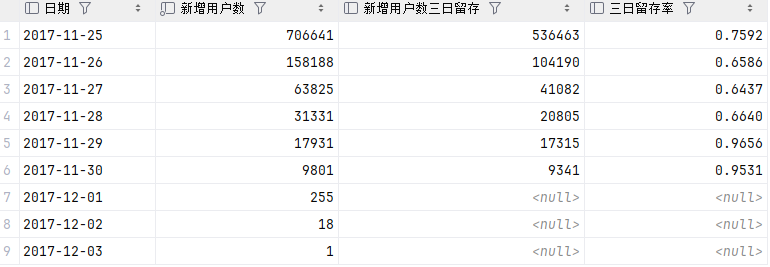
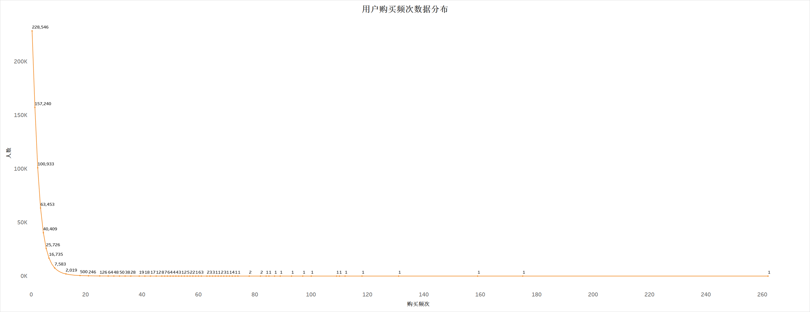
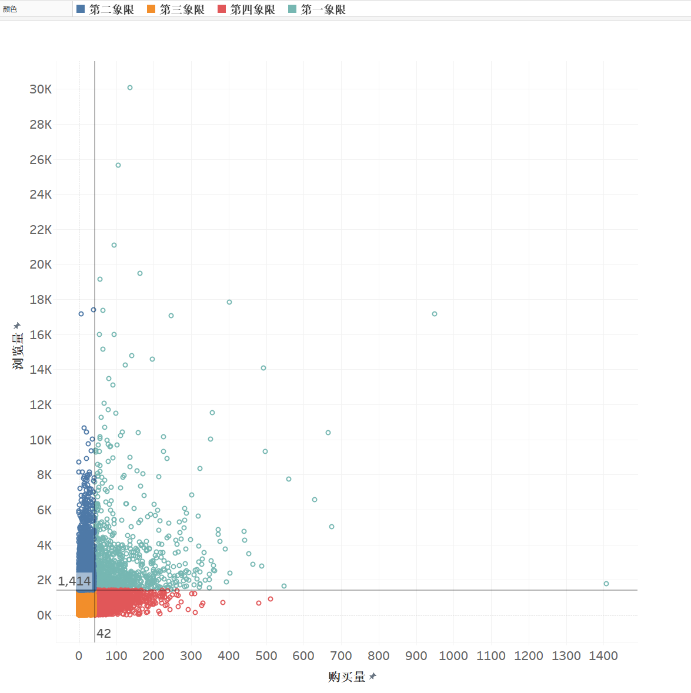

# 淘宝用户行为数据分析

本项目是基于MySQL和Tableau的对淘宝用户行为的数据分析


## 数据来源与介绍

阿里云天池公共数据集 https://tianchi.aliyun.com/dataset/649

UserBehavior是阿里巴巴提供的一个淘宝用户行为数据集,用于隐式反馈推荐问题的研究。

本数据集包含了2017年11月25日至2017年12月3日之间，有行为的约一百万随机用户的所有行为（行为包括点击、购买、加购、喜欢）。数据集的组织形式和MovieLens-20M类似，即数据集的每一行表示一条用户行为，由用户ID、商品ID、商品类目ID、行为类型和时间戳组成，并以逗号分隔。关于数据集中每一列的详细描述如下：

| 列名称 | 说明 | 
|---|---|
| 用户ID | 整数类型，序列化后的用户ID | 
| 商品ID | 整数类型，序列化后的商品ID | 
| 商品类目ID | 整数类型，序列化后的商品所属类目ID| 
| 行为类型 |字符串，枚举类型，包括('pv', 'buy', 'cart', 'fav')| 
| 时间戳 | 行为发生的时间戳| 

用户行为类型分为四种:

| 行为类型 | 说明 | 
|---|---|
| pv | 商品详情页pv，等价于点击 | 
| buy | 商品购买 | 
| cart | 将商品加入购物车| 
| fav |收藏商品| 

## 数据分析体系搭建

  

## 数据预处理

### 数据导入
图形化数据库管理工具: Datagrip

1. 新建数据库`userbehavior`
2. 右键`userbehavior`
3. 点击`导入/导出`
4. 点击`从文件导入数据`
5. 选择 `.csv` 文件路径
6. 新建表并命名`userbehavior`
7.  点击 `确认导入`
      
### 修改表字段

源数据表字段不明确,修改字段名称和数据类型并且添加汉语注释  

```sql
alter table userbehavior
	change c1 user_id int comment '用户ID',
    change c2 item_id int comment '商品ID',
    change c3 category_id int comment '商品类目ID',
    change c4 behavior enum ('pv', 'buy', 'cart', 'fav') comment '用户行为',
    change c5 datetime varchar(50) comment '行为时间';
```

将时间戳更新为日期时间, 并且拆分为日/小时字段
```sql
update userbehavior  
set datetime = date_format(from_unixtime(datetime), '%Y-%m-%d %H:%i:%s');
```
注意: `update userbehavior` 是**全表更新**，MySQL 会在事务里一次性锁住符合条件的所有行，如果表特别大（如该项目有一亿行数据），锁的数量超过为锁表分配的内存空间会报错，因此需要优化

优化: 将原表的数据读取出来，在`select`读取时进行`from_unixtime()`转换和处理，然后将处理后的数据写入一个新表
```sql
create table userbehavior_new as  
select user_id,  
       item_id,  
       category_id,  
       behavior,  
       date(from_unixtime(datetime, '%Y-%m-%d %H:%i:%s')) as date,  
       hour(from_unixtime(datetime, '%Y-%m-%d %H:%i:%s')) as hour  
from userbehavior;
#删除原表
drop table userbehavior;
#重命名新表
rename table userbehavior_new to userbehavior;
```
### 处理缺失值

对比各字段非null值计数

```sql
select count(*) as '总计数',  
  count(user_id),  
  count(item_id),  
  count(category_id),  
  count(behavior),  
  count(datetime)  
from userbehavior;
```

```sql
select * from userbehavior  
where user_id is null  
 or item_id is null  
 or category_id is null  
 or behavior is null  
 or datetime is null;
```
查询发现数据集的质量较高,缺失值数量为0

### 处理重复值

全量去重重建表

```sql
#全量去重重建表  
create table userbehavior_dedup as
select distinct user_id,
                item_id,
                category_id,
                behavior,
                datetime,
                date,
                hour
from userbehavior;
#删除原表
drop table userbehavior;
#改新表为原表名  
rename table userbehavior_dedup to userbehavior;
```
### 处理异常值

查询行为日期极值
```sql
select min(datetime) as min, max(datetime) as max from userbehavior;
```


数据集描述的时间区间应为2017年11月25日至2017年12月3日, 但查询显示仍有不在此区间的数据,此处定义为异常数据

查询异常值数量
```sql
with cte as (select *  
  from userbehavior  
  where datetime > '2017-12-03 23:59:59'  
  or datetime < '2017-11-25 00:00:00'  
  order by datetime)  
select count(1) as cnt  
from cte;
```


查询显示有55258行异常数据

删除异常数据  
```sql
#注意:时间戳存在负数,MySQL数据库默认时间戳以1970年为基点,说明存在1970年前的数据,但都不符合数据描述中的时间区间,而负数时间戳在进行from_unixtime()转化的时候会输出null值,因此将null值也一起删除
delete  
from userbehavior
where datetime > '2017-12-03 23:59:59'  
  or datetime < '2017-11-25 00:00:00'
  or datetime is null;
```
## 数据分析

将数据集分为用户和商品两个维度进行数据分析

后续所有SQL语句查询结果均储存为新表以便Tableau直接调用

### 数据总览

每日数据总览  
```sql
create table 每日数据总览 as  
select date,  
  count(distinct user_id) as '总用户数',  
  count(distinct item_id) as '总商品数',  
  count(distinct category_id) as '总商品类目数',  
  count(behavior) as '行为总次数'  
from userbehavior  
group by date  
order by date;
```
  
### 用户

#### 用户获取

每日新增用户数

```sql
#由于数据集时间只包含特定日期段,因此假设'2017-11-25'为所有数据的初始日期
create table 每日新增用户 as  
with cte as (select user_id, min(date) as 'fir_d' from userbehavior_10w group by user_id)  
select count(user_id) as '新增用户数', fir_d as '日期'  
from cte  
group by fir_d  
order by 2;
```
  
  

#### 用户活跃

活跃指标

每日页面点击量PV  
每日独立访客UV  
平均每人页面访问量PV/UV

```sql
create table 每日用户活跃 as  
select date as '日期',  
       sum(case when behavior = 'pv' then 1 else 0 end)                           as '页面点击量',  
       count(distinct user_id)                                                    as '独立访客',  
       sum(case when behavior = 'pv' then 1 else 0 end) / count(distinct user_id) as '平均每人页面访问量'  
from userbehavior  
group by date  
order by date;
```
  
  

每日跳失率
```sql
create table 每日跳失率 as  
with cte as (SELECT user_id, date from userbehavior group by user_id, date having count(*) = 1),  
     cte2 as (SELECT user_id, date from userbehavior group by user_id, date),  
     cte3 as (select date, count(*) as cnt from cte group by date),  
     cte4 as (select date, count(*) as cnt from cte2 group by date)  
select cte3.date, cte3.cnt / cte4.cnt as '跳失率'  
from cte3  
  join cte4 on cte3.date = cte4.date  
order by date;
```
  

#### 用户留存

基于活跃用户的留存率

次日留存率(记录了一些代码优化的过程,自连接优化成偏移窗口函数+索引将查询时间从1h+优化到2min)
```sql
#初版:使用datediff()函数建立表连接,查询因此没有走索引,同时由于数据过多,自连接效率低下,查询速度相当慢
with cte as (select u1.date, count(distinct u1.user_id) as cnt1  
             from userbehavior u1  
                      join userbehavior u2 on datediff(u2.date, u1.date) = 1 and u1.user_id = u2.user_id  
             group by u1.date),  
     cte2 as (select date, count(distinct user_id) as cnt2 from userbehavior group by date)  
select cte.date, cnt1 / cnt2 as "retention1"  
from cte  
         join cte2 on cte.date = cte2.date  
order by 1;
```
```sql
#优化版:使用lead()窗口函数与interval + 1 day 避免复杂的join  
WITH user_activity AS (SELECT user_id,  
                              date,  
                              LEAD(date) OVER (PARTITION BY user_id ORDER BY date) AS next_date  
                       FROM userbehavior)  
SELECT date,  
       COUNT(DISTINCT user_id)                                     AS active_users,  
       SUM(CASE WHEN next_date = date + INTERVAL 1 DAY THEN 1 END) AS retained_users,  
       SUM(CASE WHEN next_date = date + INTERVAL 1 DAY THEN 1 END) / COUNT(DISTINCT user_id) AS retention1  
FROM user_activity  
GROUP BY date  
ORDER BY date;
```
```sql
#最终版本:在第一个CTE就提前聚合
create table 基于活跃用户的次日留存率 as  
with user_activity as (select user_id,  
                              date,  
                              lead(date) over (partition by user_id order by date) as next_date  
  from userbehavior  
  group by user_id, date)  
select date as `日期`,  
       count(distinct user_id)                                                               as '活跃用户数',  
       sum(case when next_date = date + interval 1 day then 1 end)                           as '次日活跃用户数',  
       sum(case when next_date = date + interval 1 day then 1 end) / count(distinct user_id) as '次日留存率'  
from user_activity  
where date <= '2017-12-02'  
group by date  
order by date;
```
  
  

三日留存率
```sql
create table 基于活跃用户的三日留存率 as  
with user_activity as (select user_id,  
                              date,  
                              lead(date) over (partition by user_id order by date) as next_date  
  from userbehavior  
  group by user_id, date)  
select date as `日期`,  
       count(distinct user_id)                                                               as '活跃用户数',  
       sum(case when next_date = date + interval 3 day then 1 end)                           as '三日活跃用户数',  
       sum(case when next_date = date + interval 3 day then 1 end) / count(distinct user_id) as '三日留存率' 
from user_activity  
where date <= '2017-12-02'  
group by date  
order by date;
```
  

基于新增用户的留存率:

次日留存率
```sql
create table 基于新增用户的次日留存率 as  
with cte as (select user_id, min(date) as date from userbehavior group by user_id),  
     cte2 as (select cte.date, count(distinct cte.user_id) as cnt  
  from cte  
  join userbehavior u on u.date = cte.date + interval 1 day and cte.user_id = u.user_id  
  group by date),  
     cte3 as (select date, count(user_id) as cnt2 from cte group by date)  
select cte3.date as '日期', cnt2 as '新增用户数', cnt as '新增用户数次日留存', cnt / cnt2 as '次日留存率'  
from cte3  
  left join cte2 on cte2.date = cte3.date  
order by cte3.date;
```
  

三日留存率
```sql
create table 基于新增用户的三日留存率 as  
with cte as (select user_id, min(date) as date from userbehavior group by user_id),  
     cte2 as (select cte.date, count(distinct cte.user_id) as cnt  
  from cte  
  join userbehavior u on u.date = cte.date + interval 3 day and cte.user_id = u.user_id  
  group by date),  
     cte3 as (select date, count(user_id) as cnt2 from cte group by date)  
select cte3.date as '日期', cnt2 as '新增用户数', cnt as '新增用户数三日留存', cnt / cnt2 as '三日留存率'  
from cte3  
  left join cte2 on cte2.date = cte3.date  
order by cte3.date;
```
  


#### 用户行为

总行为计数

```sql
create table 总行为计数 as  
select behavior, count(*) as cnt from userbehavior group by behavior order by cnt;
```
  
 

去重用户行为计数
  
```sql
create table 去重用户行为计数 as  
select behavior, count(distinct user_id) as cnt from userbehavior group by behavior order by cnt;
```
  
  

每日分时行为一览

```sql
create table 每日分时行为一览 as  
select date as '日期',  
       hour as '小时',  
       sum(case when behavior = 'pv' then 1 else 0 end)   as '点击量',  
       sum(case when behavior = 'cart' then 1 else 0 end) as '加购量',  
       sum(case when behavior = 'fav' then 1 else 0 end)  as '收藏量',  
       sum(case when behavior = 'buy' then 1 else 0 end)  as '购买量'  
from userbehavior  
group by date, hour  
order by date, hour;
```
  
  
  

用户不同行为真值表

```sql
#基于用户  
create table 用户不同行为真值表 as  
select user_id,  
  max(case when behavior = 'pv' then 1 else 0 end) as pv,  
  max(case when behavior = 'cart' then 1 else 0 end) as cart,  
  max(case when behavior = 'fav' then 1 else 0 end) as fav,  
  max(case when behavior = 'buy' then 1 else 0 end) as buy  
from userbehavior  
group by user_id;
```
 

不同行为路径用户数
```sql
with cte as (select case  
 when pv = 1 and cart = 0 and fav = 0 and buy = 0 then '仅浏览'  
  when pv = 1 and cart = 1 and fav = 0 and buy = 0 then '浏览-加购'  
  when pv = 1 and cart = 1 and fav = 1 and buy = 0 then '浏览-加购-收藏'  
  when pv = 1 and cart = 1 and fav = 1 and buy = 1 then '浏览-加购-收藏-购买'  
  when pv = 1 and cart = 0 and fav = 0 and buy = 1 then '浏览-购买'  
  when pv = 1 and cart = 1 and fav = 0 and buy = 1 then '浏览-加购-购买'  
  when pv = 1 and cart = 0 and fav = 1 and buy = 1 then '浏览-收藏-购买' end as path  
from 用户不同行为真值表)
select path, count(*) as cnt  
from cte  
where path is not null  
group by path  
order by cnt desc;
```
 
 

#### 用户分类

用户价值模型RFM

首先确定数据分布,在确定用分位数或是自定义阈值打分

数据分布:

最近消费距今(Recency)
```sql
create table 最近消费距今天数数据分布 as  
with cte as (select user_id, datediff('2017-12-03', max(date)) as date_interval, count(*) as cnt  
  from userbehavior  
  where behavior = 'buy'  
  group by user_id)  
select date_interval as '最近消费距今天数', count(*) as '人数'  
from cte  
group by date_interval  
order by date_interval;
```
 

根据斜率变化自定义R的得分  
• 0-2天: 3分  
• 3-5天: 2分  
• 6-8天: 1分

消费频次(Frequency)
```sql
create table 消费频次数据分布 as  
with cte as (select user_id, datediff('2017-12-03', max(date)) as date_interval, count(*) as cnt  
  from userbehavior  
  where behavior = 'buy'  
  group by user_id)  
select cnt as '购买频次', count(*) as '人数'  
from cte  
group by cnt  
order by 1;
```
 

明显的长尾分布  
• 绝大多数用户（几万）只买过 1-3 次  
• 少数用户（个位数）买了几十到上百次  
• 中间段购买频次在 4~10 次的用户数量快速递减

使用RFM模型打分且划分用户分类标签
```sql
create table 不同分类用户对应数量 as  
with cte as (select user_id, datediff('2017-12-03', max(date)) as date_interval, count(*) as cnt  
  from userbehavior  
  where behavior = 'buy'  
  group by user_id),  
     cte2 as (select user_id,  
                     case  
 when date_interval between 0 and 2 then 3  
  when date_interval between 3 and 5 then 2  
  when date_interval between 6 and 8 then 1 end as r_value,  
                     case  
 when cnt = 1 then 1  
  when cnt between 2 and 4 then 2  
  when cnt between 5 and 9 then 3  
  when cnt between 10 and 29 then 4  
  when cnt >= 30 then 5 end                     as f_value  
  from cte),  
     cte3 as (SELECT user_id,  
                     r_value,  
                     f_value,  
                     CASE  
 WHEN r_value = 3 AND f_value >= 3 THEN '价值客户' -- 最近有消费，消费频率高    
 WHEN r_value <= 2 AND f_value >= 3 THEN '保持客户' -- 最近没有消费,消费频率高    
 WHEN r_value = 3 AND f_value <= 2 THEN '发展客户' -- 最近有消费，消费频率低    
 WHEN r_value <= 2 AND f_value <= 2 THEN '挽留客户' -- 最近没有消费，消费频率低    
 END AS tag  
  FROM cte2)  
select tag, count(*) as cnt  
from cte3  
group by tag  
order by cnt;
```
 

### 商品

#### 商品各指标TOP10

```sql
create table 商品各指标top10 as  
with cte as (select item_id, count(*) as cnt, behavior from userbehavior group by item_id, behavior),  
     cte2 as (select item_id, behavior, cnt, row_number() over (partition by behavior order by cnt desc) as rn from cte)  
select item_id as '商品id', behavior as '用户行为', cnt as '计数'  
from cte2  
where rn <= 10  
order by behavior;
```
 

#### 商品品类各指标TOP10

```sql
create table 商品类目各指标top10 as
with cte as (select category_id, behavior, count(*) as cnt from userbehavior group by category_id, behavior),
     cte2 as (select category_id, behavior, cnt, row_number() over (partition by behavior order by cnt desc) as rn
              from cte)
select category_id, behavior, cnt, rn
from cte2
where rn <= 10
order by behavior, category_id;
```
 

#### 商品四象限分析

取两个关键维度: 浏览,购买

取99.9%分位数作为参考线
```sql
99.9%分位数作为参考线  
WITH cte AS (  
    SELECT item_id,  
           SUM(CASE WHEN behavior = 'pv' THEN 1 ELSE 0 END) AS 浏览量,  
           SUM(CASE WHEN behavior = 'buy' THEN 1 ELSE 0 END) AS 购买量  
  FROM userbehavior  
    WHERE behavior IN ('pv','buy')  
    GROUP BY item_id  
),  
ranked AS (  
    SELECT *,  
           ROW_NUMBER() OVER (ORDER BY 浏览量)  AS rn_pv,  
           ROW_NUMBER() OVER (ORDER BY 购买量) AS rn_buy,  
           COUNT(*)     OVER ()               AS total_cnt  
    FROM cte  
)  
SELECT MIN(CASE WHEN rn_pv >= total_cnt * 0.999 THEN 浏览量 END)  AS 浏览量_99分位,  
       MIN(CASE WHEN rn_buy >= total_cnt * 0.999 THEN 购买量 END) AS 购买量_99分位  
FROM ranked;
```


 商品四象限散点分布图
```sql
create table 商品四象限散点分布图 as  
select item_id,  
       sum(case when behavior = 'pv' then 1 else 0 end)  as '浏览量',  
       sum(case when behavior = 'buy' then 1 else 0 end) as '购买量'  
from userbehavior  
where behavior in ('pv', 'buy')  
group by item_id;
```
 
