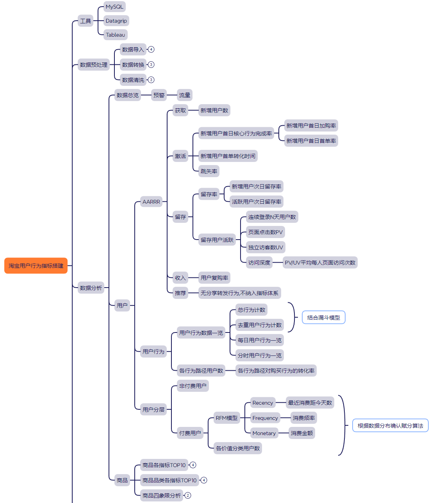
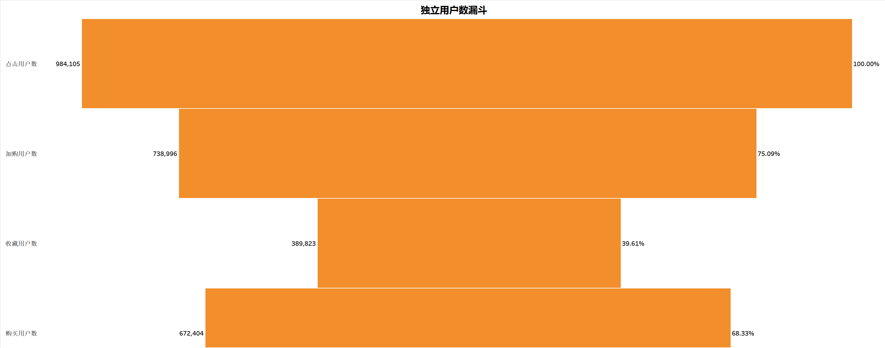

# 淘宝用户行为数据分析

本项目是基于MySQL和Tableau的对淘宝用户行为的数据分析

`.sql`文件为本项目的SQL源代码

`.twbx`文件为含有本地数据源的tableau打包工作簿

## 数据来源与介绍

阿里云天池公共数据集 https://tianchi.aliyun.com/dataset/649

UserBehavior是阿里巴巴提供的一个淘宝用户行为数据集,用于隐式反馈推荐问题的研究。

本数据集包含了2017年11月25日至2017年12月3日之间，有行为的约一百万随机用户的所有行为（行为包括点击、购买、加购、喜欢）。数据集的组织形式和MovieLens-20M类似，即数据集的每一行表示一条用户行为，由用户ID、商品ID、商品类目ID、行为类型和时间戳组成，并以逗号分隔。关于数据集中每一列的详细描述如下：

| 列名称 | 说明 | 
|---|---|
| 用户ID | 整数类型，序列化后的用户ID | 
| 商品ID | 整数类型，序列化后的商品ID | 
| 商品类目ID | 整数类型，序列化后的商品所属类目ID| 
| 行为类型 |字符串，枚举类型，包括('pv', 'buy', 'cart', 'fav')| 
| 时间戳 | 行为发生的时间戳| 

用户行为类型分为四种:

| 行为类型 | 说明 | 
|---|---|
| pv | 商品详情页pv，等价于点击 | 
| buy | 商品购买 | 
| cart | 将商品加入购物车| 
| fav |收藏商品| 

## 指标体系搭建

用户维度

根据AARRR海盗模型和用户行为,用户分类三个层面建立指标(用户行为与用户分类贯穿AARRR模型,因此单独列出)

||度量指标|
|---|---|
| Acquisition(获取) |新增用户数|
| Activation(激活)  |新增用户首日加购率/新增用户首日首单率/新增用户首单转化时间/跳失率|
| Retention(留存)   |新增用户次日留存率/活跃用户次日留存率/连续登录N天用户数/页面点击数PV/独立访客数UV/访问深度|
| Revenue(收入)     |用户复购率|
| Referral(推荐)    |数据集中无转发/分享行为,不纳入指标|
| 用户行为          |总行为计数/去重用户行为计数/不同行为路径用户数/不同路径对用户购买的转化率|
| 用户分层          |用户最近消费距今天数/用户消费频次/不同分类用户对应数量|

商品维度

||度量指标|
|---|---|
|商品各指标TOP10|点击量TOP10/收藏量TOP10/加购量TOP10/购买量TOP10|
|商品品类各指标TOP10|点击量TOP10/收藏量TOP10/加购量TOP10/购买量TOP10|
|商品四象限分析|浏览量/购买量|


  


## 数据预处理

### 数据导入
图形化数据库管理工具: Datagrip

1. 新建数据库`userbehavior`
2. 右键`userbehavior`
3. 点击`导入/导出`
4. 点击`从文件导入数据`
5. 选择 `.csv` 文件路径
6. 新建表并命名`userbehavior`
7.  点击 `确认导入`
      
### 数据转换

源数据表字段不明确,修改表字段名称和数据类型并且添加汉语注释  

```sql
alter table userbehavior
	change c1 user_id int comment '用户ID',
    change c2 item_id int comment '商品ID',
    change c3 category_id int comment '商品类目ID',
    change c4 behavior enum ('pv', 'buy', 'cart', 'fav') comment '用户行为',
    change c5 datetime varchar(50) comment '行为时间';
```

将时间戳更新为日期时间, 并且拆分为日/小时字段
```sql
update userbehavior  
set datetime = date_format(from_unixtime(datetime), '%Y-%m-%d %H:%i:%s');
```
注意: `update userbehavior` 是**全表更新**，MySQL 会在事务里一次性锁住符合条件的所有行，如果表特别大（如该项目有一亿行数据），锁的数量超过为锁表分配的内存空间会报错，因此需要优化

优化: 将原表的数据读取出来，在`select`读取时进行`from_unixtime()`转换和处理，然后将处理后的数据写入一个新表
```sql
create table userbehavior_new as  
select user_id,  
       item_id,  
       category_id,  
       behavior,  
       date(from_unixtime(datetime, '%Y-%m-%d %H:%i:%s')) as date,  
       hour(from_unixtime(datetime, '%Y-%m-%d %H:%i:%s')) as hour  
from userbehavior;
#删除原表
drop table userbehavior;
#重命名新表
rename table userbehavior_new to userbehavior;
```
### 数据清洗

#### 处理缺失值

对比各字段非null值计数

```sql
select count(*) as '总计数',  
  count(user_id),  
  count(item_id),  
  count(category_id),  
  count(behavior),  
  count(datetime)  
from userbehavior;
```

```sql
select * from userbehavior  
where user_id is null  
 or item_id is null  
 or category_id is null  
 or behavior is null  
 or datetime is null;
```
查询发现数据集的质量较高,缺失值数量为0

#### 处理重复值

全量去重重建表

```sql
#全量去重重建表  
create table userbehavior_dedup as
select distinct user_id,
                item_id,
                category_id,
                behavior,
                datetime,
                date,
                hour
from userbehavior;
#删除原表
drop table userbehavior;
#改新表为原表名  
rename table userbehavior_dedup to userbehavior;
```
#### 处理异常值

查询行为日期极值
```sql
select min(datetime) as min, max(datetime) as max from userbehavior;
```


数据集描述的时间区间应为2017年11月25日至2017年12月3日, 但查询显示仍有不在此区间的数据,此处定义为异常数据

查询异常值数量
```sql
with cte as (select *  
  from userbehavior  
  where datetime > '2017-12-03 23:59:59'  
  or datetime < '2017-11-25 00:00:00'  
  order by datetime)  
select count(1) as cnt  
from cte;
```


查询显示有55258行异常数据

删除异常数据  
```sql
#注意:时间戳存在负数,MySQL数据库默认时间戳以1970年为基点,说明存在1970年前的数据,但都不符合数据描述中的时间区间,而负数时间戳在进行from_unixtime()转化的时候会输出null值,因此将null值也一起删除
delete  
from userbehavior
where datetime > '2017-12-03 23:59:59'  
  or datetime < '2017-11-25 00:00:00'
  or datetime is null;
```
## 数据分析

后续所有SQL语句查询结果均储存为新表以便Tableau直接调用

### 数据总览
```sql
create table 数据总览 as
select
  count(distinct user_id) as '总用户数',
  count(distinct item_id) as '总商品数',
  count(distinct category_id) as '总商品类目数',
  count(behavior) as '行为总次数'
from userbehavior;
```

```sql
create table 每日数据总览 as  
select date,  
  count(distinct user_id) as '总用户数',  
  count(distinct item_id) as '总商品数',  
  count(distinct category_id) as '总商品类目数',  
  count(behavior) as '行为总次数'  
from userbehavior  
group by date  
order by date;
```
  

### 用户

#### Acquisition获取

##### 每日新增用户数

```sql
#由于数据集时间只包含特定日期段,因此假设'2017-11-25'为所有数据的初始日期
create table 每日新增用户 as  
with cte as (select user_id, min(date) as 'fir_d' from userbehavior group by user_id)  
select count(user_id) as '新增用户数', fir_d as '日期'  
from cte  
group by fir_d  
order by 2;
```
  
  

由于数据集时间跨度仅从2017-11-25到2017-12-03,没有2017-11-25日之前的数据,因此无法获取相当部分用户的真实历史最早登录时间,因此该数据和曲线只能供参考,更多反映的是该9天内新出现的用户数

#### Activation激活

##### 每日跳失率
```sql
create table 每日跳失率 as  
with cte as (SELECT user_id, date from userbehavior group by user_id, date having count(*) = 1),  
     cte2 as (SELECT user_id, date from userbehavior group by user_id, date),  
     cte3 as (select date, count(*) as cnt from cte group by date),  
     cte4 as (select date, count(*) as cnt from cte2 group by date)  
select cte3.date, cte3.cnt / cte4.cnt as '跳失率'  
from cte3  
  join cte4 on cte3.date = cte4.date  
order by date;
```
  

跳失率:用户在仅访问一个页面后就离开的比例,是衡量网站吸引力和用户体验的重要指标.每日的跳失率在12.2%到13.7%之间波动,表明网站或应用的用户体验相对较好,大部分用户在访问后会进行其他行为,而不仅仅是停留在单个页面上.

##### 新增用户首日核心行为完成率

##### 新增用户首日首单率
```sql
新增用户首日首单率
with cte as (select user_id, min(date) as fir_d, min(case when behavior = 'buy' then date end) as if_buy_date
             from userbehavior
             group by user_id)
select fir_d                                     as 日期,
       count(user_id)                            as 新增用户数,
       sum(if_buy_date = fir_d)                  as 新增用户首日首单数,
       sum(if_buy_date = fir_d) / count(user_id) as 新增用户首日首单率
from cte
group by fir_d
order by 日期;
```

##### 新增用户首单转化时间
```sql
create table 新增用户首单转化时间 as
with cte as (select user_id,
                    min(date)                                                                                      as fir_d,
                    timestampdiff(second, min(datetime), min(case when behavior = 'buy' then datetime end)) /
                    3600                                                                                           as diff
             from userbehavior
             group by user_id)
select fir_d as 日期, round(avg(diff),1) as 每日新增用户平均首单转化小时
from cte
where diff is not null
group by fir_d
order by 1;
```

#### Retention留存

##### 基于活跃用户的次日留存率

(记录了一些代码优化的过程,添加了索引,自连接查询优化成lead偏移窗口函数,on子句对日期的连接方式datediff()函数优化成interval 1 day以便走索引,优化查询时间:1h+-->20min-->2min)

```sql
#初版:使用datediff()函数建立表连接,查询因此没有走索引,同时由于数据过多,自连接效率低下,查询速度相当慢
with cte as (select u1.date, count(distinct u1.user_id) as cnt1  
             from userbehavior u1  
                      join userbehavior u2 on datediff(u2.date, u1.date) = 1 and u1.user_id = u2.user_id  
             group by u1.date),  
     cte2 as (select date, count(distinct user_id) as cnt2 from userbehavior group by date)  
select cte.date, cnt1 / cnt2 as "retention1"  
from cte  
         join cte2 on cte.date = cte2.date  
order by 1;
```
```sql
#优化版:使用lead()窗口函数与interval + 1 day 避免复杂的join  
WITH user_activity AS (SELECT user_id,  
                              date,  
                              LEAD(date) OVER (PARTITION BY user_id ORDER BY date) AS next_date  
                       FROM userbehavior)  
SELECT date,  
       COUNT(DISTINCT user_id)                                     AS active_users,  
       SUM(CASE WHEN next_date = date + INTERVAL 1 DAY THEN 1 END) AS retained_users,  
       SUM(CASE WHEN next_date = date + INTERVAL 1 DAY THEN 1 END) / COUNT(DISTINCT user_id) AS retention1  
FROM user_activity  
GROUP BY date  
ORDER BY date;
```
```sql
#最终版本:在第一个CTE就提前聚合
create table 基于活跃用户的次日留存率 as  
with user_activity as (select user_id,  
                              date,  
                              lead(date) over (partition by user_id order by date) as next_date  
  from userbehavior  
  group by user_id, date)  
select date as `日期`,  
       count(distinct user_id)                                                               as '活跃用户数',  
       sum(case when next_date = date + interval 1 day then 1 end)                           as '次日活跃用户数',  
       sum(case when next_date = date + interval 1 day then 1 end) / count(distinct user_id) as '次日留存率'  
from user_activity  
where date <= '2017-12-02'  
group by date  
order by date;
```
  
  

查询用时对比(均已添加对应索引,否则用时超过1h)

优化前

  

优化后

  


##### 基于新增用户的次日留存率

```sql
create table 基于新增用户的次日留存率 as  
with cte as (select user_id, min(date) as date from userbehavior group by user_id),  
     cte2 as (select cte.date, count(distinct cte.user_id) as cnt  
  from cte  
  join userbehavior u on u.date = cte.date + interval 1 day and cte.user_id = u.user_id  
  group by date),  
     cte3 as (select date, count(user_id) as cnt2 from cte group by date)  
select cte3.date as '日期', cnt2 as '新增用户数', cnt as '新增用户数次日留存', cnt / cnt2 as '次日留存率'  
from cte3  
  left join cte2 on cte2.date = cte3.date  
order by cte3.date;
```
  

##### 留存用户活跃

###### 每日页面点击量PV  
###### 每日独立访客UV  
###### 每日平均每人页面访问量PV/UV

```sql
create table 每日用户活跃 as  
select date as '日期',  
       sum(case when behavior = 'pv' then 1 else 0 end)                           as '页面点击量',  
       count(distinct user_id)                                                    as '独立访客',  
       sum(case when behavior = 'pv' then 1 else 0 end) / count(distinct user_id) as '平均每人页面访问量'  
from userbehavior  
group by date  
order by date;
```
  
  

页面点击量(PV):总体流量指标.每日的PV值在900万到1200万之间波动,表明网站的整体流量非常庞大.12月2日和12月3日的PV值相较于11月下旬有显著增长,也许与周末有关,但上个周六周日的数据和这之后的周一到周五并没有明显的波动,因此考虑节日促销或特定的营销活动,推测是双十二活动预热

独立访客(UV):独立用户数的指标.独立访客数也稳定在70万到97万之间,与PV值的波动趋势基本一致,反映了稳定的用户基础,也说明访问流量增长主要来自更多访客，而不是单一用户访问加深

访问深度/平均每人页面访问量(PV/UV):用户的参与度和粘性指标.平均每个独立访客在每天会浏览12到14个页面,相对稳定,说明用户的浏览习惯和兴趣水平在时间维度上没有太大变化


###### 连续登录n天用户数
```sql
#gaps and island
with cte as (select user_id, date from userbehavior group by user_id, date),
     cte2 as (select user_id, date, lag(date) over (partition by user_id order by date) as last_date from cte),
     cte3 as (select user_id,
                     date,
                     case when date = last_date + interval 1 day or last_date is null then 0 else 1 end as mark
              from cte2),
     cte4 as (select user_id, sum(mark) over (partition by user_id order by date) as mark from cte3),
     cte5 as (select user_id, count(*) as cnt from cte4 group by user_id, mark having count(*) = n)
select count(distinct user_id) as cnt
from cte5;
```


#### 用户行为

##### 总行为计数

```sql
create table 总行为计数 as  
select behavior, count(*) as cnt from userbehavior group by behavior order by cnt;
```
  
 

通过该漏斗模型发现,总页面浏览量高达89,660,671次,这代表着网站的总体流量非常庞大.然而总购买次数占总浏览次数的2.25%,这表明在所有的页面浏览行为中，最终只有极少数的行为转化为实际购买.由于该总行为次数漏斗是线性模型,它假设用户行为是严格按照PV -> Cart -> Fav -> Buy的顺序进行的，但实际情况可能并非如此,用户可能会跳过中间步骤,或者来回重复某些步骤,因此并不能完全反应各行为之间准确的关系以及各行为对购买率的转化率,后续会针对各行为路径进行单独分析

##### 去重用户行为计数
  
```sql
create table 去重用户行为计数 as  
select behavior, count(distinct user_id) as cnt from userbehavior group by behavior order by cnt;
```
  
  

加购用户数远高于收藏用户数,说明用户更倾向于使用加购功能而非收藏,通过对比加购/收藏->购买的转化率也可以发现加购功能对购买的促进作用明显强于收藏功能
购买用户数高于收藏用户数,因为收藏并不是购买的必要路径


##### 每日分时行为一览

```sql
create table 每日分时行为一览 as  
select date as '日期',  
       hour as '小时',  
       sum(case when behavior = 'pv' then 1 else 0 end)   as '点击量',  
       sum(case when behavior = 'cart' then 1 else 0 end) as '加购量',  
       sum(case when behavior = 'fav' then 1 else 0 end)  as '收藏量',  
       sum(case when behavior = 'buy' then 1 else 0 end)  as '购买量'  
from userbehavior  
group by date, hour  
order by date, hour;
```
  

每日行为数趋势同每日活跃趋势一样,在前7天保持稳定,12月2日-3日激增,推测还是受到双十二预热活动的影响
  
用户行为量在一天中的不同时段呈现出非常规律的波动，可以分为三个主要阶段：

流量低谷期（0:00 - 7:00）

在午夜至清晨这段时间，所有行为的数量都处于全天的最低谷。

点击量（pv）在凌晨4点左右降至最低点，仅为约45万次(日间时间一般为几百万次)。这符合大多数用户在深夜休息的习惯。

加购、收藏和购买等行为量也同步降到最低，这表明用户在这个时段的购物意愿和行为都非常低。

流量增长期（8:00 - 18:00）

从上午8点开始，随着用户进入工作或学习状态，各项行为数开始快速爬升。

点击量、加购量和购买量在上午10点至12点达到一个相对的小高峰。这可能与用户在工作间隙的碎片化浏览行为有关。

午间（12:00-14:00）的行为量保持在高位，随后在下午略有波动，但整体趋势仍是稳步上升。

流量高峰期（19:00 - 23:00）

晚间是全天用户行为最活跃的黄金时段。

从晚上7点开始，所有行为数都进入了高速增长期，并在晚上21点至22点达到峰值。

以点击量为例，在晚上9点达到全天最高的780万次。

购买量也在此期间达到峰值，表明用户倾向于在晚间有更多空闲时间时，集中进行浏览、比较和最终购买。


##### 用户不同行为真值表

```sql
#基于用户  
create table 用户不同行为真值表 as  
select user_id,  
  max(case when behavior = 'pv' then 1 else 0 end) as pv,  
  max(case when behavior = 'cart' then 1 else 0 end) as cart,  
  max(case when behavior = 'fav' then 1 else 0 end) as fav,  
  max(case when behavior = 'buy' then 1 else 0 end) as buy  
from userbehavior  
group by user_id;
```
 

##### 不同行为路径用户数
```sql
with cte as (select case  
 when pv = 1 and cart = 0 and fav = 0 and buy = 0 then '仅浏览'  
  when pv = 1 and cart = 1 and fav = 0 and buy = 0 then '浏览-加购'  
  when pv = 1 and cart = 1 and fav = 1 and buy = 0 then '浏览-加购-收藏'  
  when pv = 1 and cart = 1 and fav = 1 and buy = 1 then '浏览-加购-收藏-购买'  
  when pv = 1 and cart = 0 and fav = 0 and buy = 1 then '浏览-购买'  
  when pv = 1 and cart = 1 and fav = 0 and buy = 1 then '浏览-加购-购买'  
  when pv = 1 and cart = 0 and fav = 1 and buy = 1 then '浏览-收藏-购买' end as path  
from 用户不同行为真值表)
select path, count(*) as cnt  
from cte  
where path is not null  
group by path  
order by cnt desc;
```
 
 

加购是关键行为：在所有路径中，“浏览-加购-购买”（34.70%）是用户数量最多的路径。这表明用户倾向于先将商品加入购物车，再进行购买，加购行为是促成购买的关键中间步骤。此外，“浏览-加购-收藏-购买”也占据了第二大的份额（21.75%）。

主流购买路径：总共有四种路径最终导向了购买行为。将这些路径的用户数加起来（324,802 + 69,032 + 71,870 + 203,606 = 669,310），可以得到总共有669,310名用户在数据周期内完成了购买。这证明了平台的用户转化率是相当高的。

用户行为的多样性：图表清晰地显示，用户的行为路径并非单一的线性模式。除了最主要的“加购”路径，也有相当一部分用户直接从浏览跳转到购买（7.37%），或者将收藏行为作为购买的中间步骤（7.68%）。因此不能只关注单一的转化漏斗，而应尽可能为不同类型的用户行为提供个性化的体验。

“仅浏览”用户占比不高：仅浏览而没有后续行为的用户占比为6.36%，相对较低，表明大部分访问网站的用户都具有明确的意图，并且愿意进行更深层次的互动。


##### 不同路径对用户购买的转化率(剔除其他行为影响)
```sql
#基于用户维度
#浏览-购买(无收藏/加购行为)
select sum(case when pv = 1 and cart = 0 and fav = 0 then 1 else 0 end)             as '浏览用户数',
       sum(case when pv = 1 and cart = 0 and fav = 0 and buy = 1 then 1 else 0 end) as '购买用户数',
       sum(case when pv = 1 and cart = 0 and fav = 0 and buy = 1 then 1 else 0 end) /
       sum(case when pv = 1 and cart = 0 and fav = 0 then 1 else 0 end)             as '转化率'
from 用户不同行为真值表;
#浏览-加购-收藏-购买
select sum(case when pv = 1 and cart = 1 and fav = 1 then 1 else 0 end)             as '浏览-加购-收藏用户数',
       sum(case when pv = 1 and cart = 1 and fav = 1 and buy = 1 then 1 else 0 end) as '浏览-加购-收藏-购买用户数',
       sum(case when pv = 1 and cart = 1 and fav = 1 and buy = 1 then 1 else 0 end) /
       sum(case when pv = 1 and cart = 1 and fav = 1 then 1 else 0 end)             as '转化率'
from 用户不同行为真值表;
#浏览-加购-购买(无收藏行为)
select sum(case when pv = 1 and cart = 1 and fav = 0 then 1 else 0 end)             as '浏览-加购用户数',
       sum(case when pv = 1 and cart = 1 and fav = 0 and buy = 1 then 1 else 0 end) as '浏览-加购-购买用户数',
       sum(case when pv = 1 and cart = 1 and fav = 0 and buy = 1 then 1 else 0 end)/sum(case when pv = 1 and cart = 1 and fav = 0 then 1 else 0 end) as '转化率'
from 用户不同行为真值表;
#浏览-收藏-购买(无加购行为)
select sum(case when pv = 1 and cart = 0 and fav = 1 then 1 else 0 end)             as '浏览-收藏用户数',
       sum(case when pv = 1 and cart = 0 and fav = 1 and buy = 1 then 1 else 0 end) as '浏览-收藏-购买用户数',
       sum(case when pv = 1 and cart = 0 and fav = 1 and buy = 1 then 1 else 0 end)/sum(case when pv = 1 and cart = 0 and fav = 1 then 1 else 0 end) as '转化率'
from 用户不同行为真值表;
```


#### 用户分层

##### 用户价值模型RFM

首先确定数据分布,在确定用分位数或是自定义阈值打分

数据分布:

最近消费距今天数(Recency)
```sql
create table 最近消费距今天数数据分布 as  
with cte as (select user_id, datediff('2017-12-03', max(date)) as date_interval, count(*) as cnt  
  from userbehavior  
  where behavior = 'buy'  
  group by user_id)  
select date_interval as '最近消费距今天数', count(*) as '人数'  
from cte  
group by date_interval  
order by date_interval;
```
 

根据斜率变化自定义R的得分  
• 0-2天: 3分  
• 3-5天: 2分  
• 6-8天: 1分

消费频次(Frequency)
```sql
create table 消费频次数据分布 as  
with cte as (select user_id, datediff('2017-12-03', max(date)) as date_interval, count(*) as cnt  
  from userbehavior  
  where behavior = 'buy'  
  group by user_id)  
select cnt as '购买频次', count(*) as '人数'  
from cte  
group by cnt  
order by cnt;
```
 

明显的长尾分布  
• 绝大多数用户（50w）只买过 1-3 次  
• 少数用户（1k）买了几十到上百次  
• 中间段购买频次在4~10次的用户数量快速递减

因此根据购买频次手动设置阈值打分

使用RFM模型打分且划分用户分类标签
```sql
create table 不同分类用户对应数量 as  
with cte as (select user_id, datediff('2017-12-03', max(date)) as date_interval, count(*) as cnt  
  from userbehavior  
  where behavior = 'buy'  
  group by user_id),  
     cte2 as (select user_id,  
                     case  
 when date_interval between 0 and 2 then 3  
  when date_interval between 3 and 5 then 2  
  when date_interval between 6 and 8 then 1 end as r_value,  
                     case  
 when cnt = 1 then 1  
  when cnt between 2 and 4 then 2  
  when cnt between 5 and 9 then 3  
  when cnt between 10 and 29 then 4  
  when cnt >= 30 then 5 end                     as f_value  
  from cte),  
     cte3 as (SELECT user_id,  
                     r_value,  
                     f_value,  
                     CASE  
 WHEN r_value = 3 AND f_value >= 3 THEN '价值客户' -- 最近有消费，消费频率高    
 WHEN r_value <= 2 AND f_value >= 3 THEN '保持客户' -- 最近没有消费,消费频率高    
 WHEN r_value = 3 AND f_value <= 2 THEN '发展客户' -- 最近有消费，消费频率低    
 WHEN r_value <= 2 AND f_value <= 2 THEN '挽留客户' -- 最近没有消费，消费频率低    
 END AS tag  
  FROM cte2)  
select tag, count(*) as cnt  
from cte3  
group by tag  
order by cnt;
```
 

| 用户分层   | 特征描述                         | 运营目标               | 运营策略                                                                 |
| ---------- | -------------------------------- | ---------------------- | ------------------------------------------------------------------------ |
| 价值客户   | 最近有消费，消费频率高           | 保持忠诚，提升复购价值 | 会员专属权益、积分体系、等级特权；新品优先体验；满减/加购赠品提升客单价 |
| 保持客户   | 最近未消费，消费频率高           | 防止流失，召回用户     | 定向召回活动（优惠券、满减券）；唤醒提醒（降价通知）；历史高频品类推荐   |
| 发展客户   | 最近有消费，消费频率低           | 提升活跃度，培养习惯   | 首单后跟进（新人礼包、二次购买优惠）；跨品类推荐；增加触点，提高曝光     |
| 挽留客户   | 最近未消费，消费频率低           | 唤回流失，评估价值     | 大额优惠券/赠品召回；调研流失原因；长期不活跃则降低优先级运营投入       |


### 商品

#### 商品各指标TOP10

```sql
create table 商品各指标top10 as  
with cte as (select item_id, count(*) as cnt, behavior from userbehavior group by item_id, behavior),  
     cte2 as (select item_id, behavior, cnt, row_number() over (partition by behavior order by cnt desc) as rn from cte)  
select item_id as '商品id', behavior as '用户行为', cnt as '计数'  
from cte2  
where rn <= 10  
order by behavior;
```
 

#### 商品品类各指标TOP10

```sql
create table 商品类目各指标top10 as
with cte as (select category_id, behavior, count(*) as cnt from userbehavior group by category_id, behavior),
     cte2 as (select category_id, behavior, cnt, row_number() over (partition by behavior order by cnt desc) as rn
              from cte)
select category_id, behavior, cnt, rn
from cte2
where rn <= 10
order by behavior, category_id;
```
 

#### 商品四象限分析

取两个关键维度: 浏览,购买

 商品四象限散点分布图
 
```sql
create table 商品四象限散点分布图 as  
select item_id,  
       sum(case when behavior = 'pv' then 1 else 0 end)  as '浏览量',  
       sum(case when behavior = 'buy' then 1 else 0 end) as '购买量'  
from userbehavior  
where behavior in ('pv', 'buy')  
group by item_id;
```
取99.9%分位数作为参考线

```sql
WITH ranked AS (  
    SELECT *,  
           ROW_NUMBER() OVER (ORDER BY 浏览量)  AS rn_pv,  
           ROW_NUMBER() OVER (ORDER BY 购买量) AS rn_buy,  
           COUNT(*)     OVER ()               AS total_cnt  
    FROM cte  
)  
SELECT MIN(CASE WHEN rn_pv >= total_cnt * 0.999 THEN 浏览量 END)  AS 浏览量_99分位,  
       MIN(CASE WHEN rn_buy >= total_cnt * 0.999 THEN 购买量 END) AS 购买量_99分位  
FROM ranked;
#99.9%分位:浏览量1414,购买量42
```

 

| 象限 | 浏览量 | 购买量 | 商品特征 | 运营策略 |
| ---- | ------ | ------ | -------- | -------- |
| 第一象限（爆款商品） | 高 | 高 | 平台热销、用户最喜欢且高转化 | 重点维护，保证库存充足与物流高效 |
| 第二象限（潜力商品） | 高 | 低 | 吸引力高但转化障碍存在 | 分析原因（价格、描述、评价、库存），优化促销与信息呈现 |
| 第三象限（滞销商品） | 低 | 低 | 关注度低、销售不佳 | 评估是否下架或调整策略，减少资源投入 |
| 第四象限（口碑商品/小众爆款） | 低 | 高 | 转化率高、复购率高或外部引流 | 挖掘特点，进行关联推荐或提升曝光位置 |

